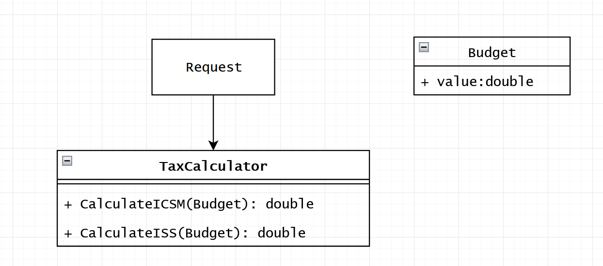
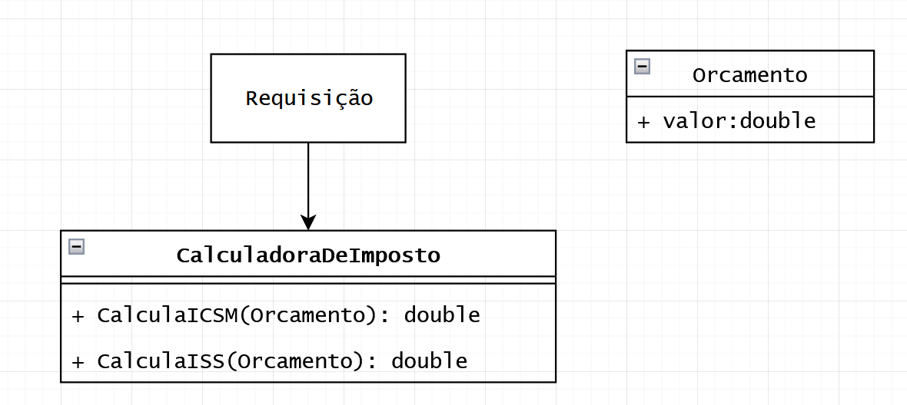
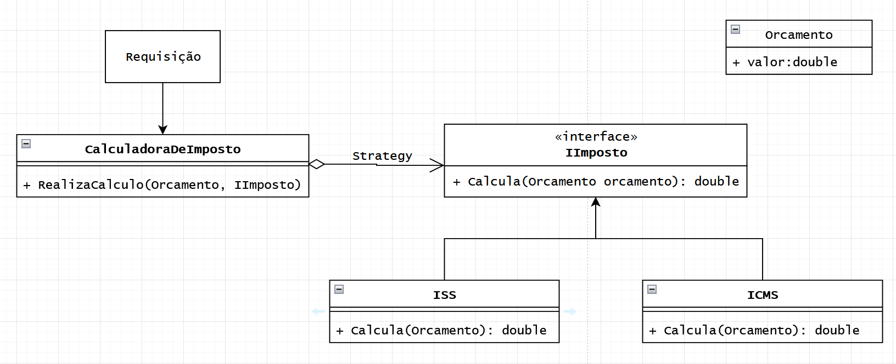

# STRATEGY
## Design Patterns 

**About this project (en-US 🇺🇸).**

## Why?

This project is part of my personal portfolio, so any feedback or suggestion that can contribute to my growth and improve my development skills will be most welcome.

# Project description:

Speaking a little about Design Patterns. The example project used here is about STRATEY.

Strategy is a design pattern that allows you to define new operations without changing the classes of the elements on which it operates, increasing cohesion, code maintainability and reducing coupling.

**Complexity level:** LOW LEVEL

**Popularity:** HIGH

Below we have two representations in class diagrams of how to implement a functionality for tax calculation.

## Bad way

Some Downsides:
- High coupling
- Bad maintainability

## Good way:

Some Upsides:

- Low coupling
- Replace inheritance with composition.
- Applied the Open-closed Principle (SOLID)
- Dependency Inversion Principle

--------------------------------------------------------------------------------------------------------------------------------------------------------------------------------
**Sobre o projeto (pt-BR 🇧🇷).**

## Descição do projeto:

Falando um pouco sobre Padrões de Projeto (Design Patterns), o exemplo praticado aqui é o STRATEGY.

O Strategy é um padrão que permite definir novas operações sem alterar as classes dos elementos sobre os quais opera, aumentando a coesão, manutenibilidade do código e reduzindo o acoplamento.

**Nível de complexidade:** BAIXA COMPLEXIDADE

**Popularidade:** ALTA

Abaixo temos uma duas representações em diagramas de classes de como imlementar uma funcionalidade para cálculo de imposto.

## Solução menos adequada

Algumas Desvantagens:
- Alto acoplamento
- Manutenibilidade ruim

## Solução mais adequada:

Algumas Vantagens:

- Baixo acomplamento
- Substituir herança por composição.
- Aplicado o Princípio Aberto-Fechado (SOLID)
- Inversão de dependência
