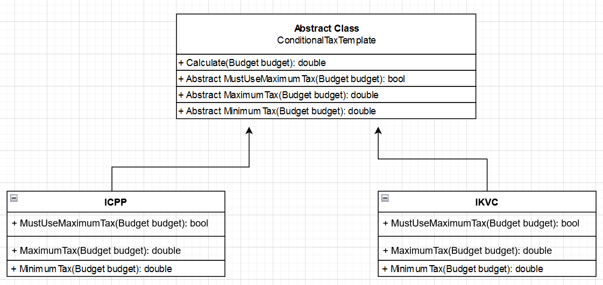
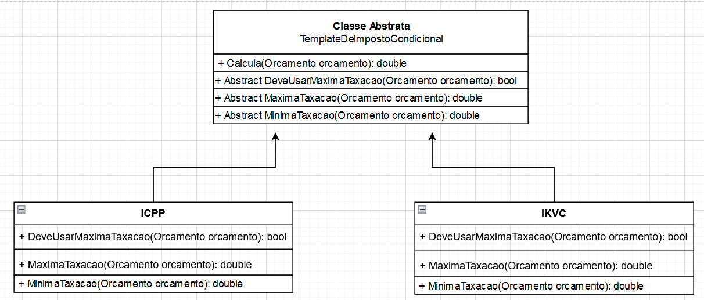

# TEMPLATE METHOD
## Design Patterns 

**About this project (en-US 🇺🇸).**

## Why?

This project is part of my personal portfolio, so any feedback or suggestion that can contribute to my growth and improve my development skills will be most welcome.

# Project description:

Speaking a little about Design Patterns. The example project used here is about TEMPLATE METHOD.

Template Method is a pattern that assists in defining an algorithm with parts of it defined by abstract methods (using Heritage).

## Implementation:

Some Upsides:

- Duplicate code stays in a superclass
- Maintenance on just a few parts of a large algorithm

--------------------------------------------------------------------------------------------------------------------------------------------------------------------------------
**Sobre o projeto (pt-BR 🇧🇷).**

## Descição do projeto:

Falando um pouco sobre Padrões de Projeto (Design Patterns), o exemplo praticado aqui é o TEMPLATE METHOD.

O Template Method é um padrão que auxilia na definição de um algoritmo com partes do mesmo definidos por métodos abstratos (Utilizando Herança).

## Implementação:

Algumas Vantagens:

- Código duplicado fica em uma superclasse.
- A manutenção acontece em apenas algumas partes de um algoritmo grande.
