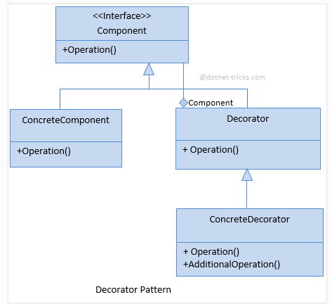

# DECORATOR
## Design Patterns 

**About this project (en-US 🇺🇸).**

## Why?

This project is part of my personal portfolio, so any feedback or suggestion that can contribute to my growth and improve my development skills will be most welcome.

# Project description:

Speaking a little about Design Patterns. The example project used here is about Decorator.

Decorator lets you dynamically add behavior/responsibilities to an existing object at runtime..
## Implementation:

Some Upsides:

- Applied the Single-responsibility Principle (SOLID).
- Extending an object's behavior without creating a new child class.
- Add or remove responsibilities from an object at runtime.

--------------------------------------------------------------------------------------------------------------------------------------------------------------------------------
**Sobre o projeto (pt-BR 🇧🇷).**

## Descição do projeto:

Falando um pouco sobre Padrões de Projeto (Design Patterns), o exemplo praticado aqui é o Decorator.

O Decorator permite adicionar um comportamento/responsabilidades dinamicamente a um objeto já existente em tempo de execução.

## Implementação:

Algumas Vantagens:

- Aplicado o Princípio da responsabilidade única (SOLID).
- Extensão de comportamento de um objeto sem criar uma nova classe filha.
- Adicionar ou remover responsabilidades de um objeto em tempo de execução.
