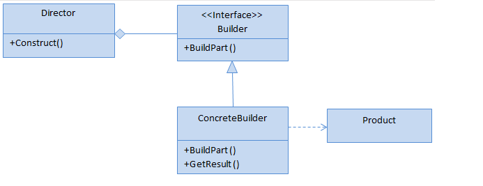
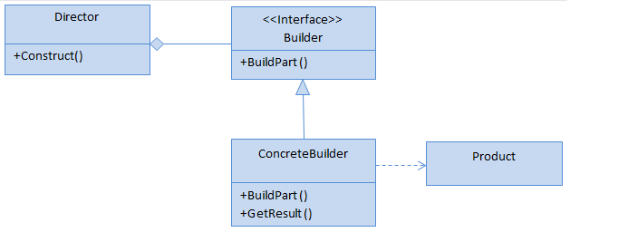

# BUILDER
## Design Patterns 

**About this project (en-US 🇺🇸).**

## Why?

This project is part of my personal portfolio, so any feedback or suggestion that can contribute to my growth and improve my development skills will be most welcome.

# Project description:

Speaking a little about Design Patterns. The example project used here is about Builder.

Builder lets you produce different types and representations of an object using the same build code.
## Implementation:

Some Upsides:

- Applied the Single-responsibility Principle (SOLID).
- You can reuse the same build code when creating multiple representations. 

--------------------------------------------------------------------------------------------------------------------------------------------------------------------------------
**Sobre o projeto (pt-BR 🇧🇷).**

## Descição do projeto:

Falando um pouco sobre Padrões de Projeto (Design Patterns), o exemplo praticado aqui é o Builder.

O Builder permite produzir diferentes tipos e representações de um objeto usando o mesmo código de construção.

## Implementação:

Algumas Vantagens:

- Aplicado o Princípio da responsabilidade única (SOLID).
- Você pode reutilizar o mesmo código de construção ao criar várias representações.

