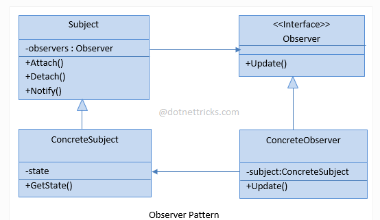

# OBSERVER
## Design Patterns 

**About this project (en-US 🇺🇸).**

## Why?

This project is part of my personal portfolio, so any feedback or suggestion that can contribute to my growth and improve my development skills will be most welcome.

# Project description:

Speaking a little about Design Patterns. The example project used here is about Observer.

Observer is a software design pattern that defines a one-to-many dependency between objects so that when an object changes state, all of its dependents are automatically notified and updated. 

**Complexity level:** MID LEVEL

**Popularity:** HIGH

## Implementation:

Some Upsides:

- Applied the Open-closed Principle (SOLID).
- Estabelecer relações entre objetos em tempo de execução.

--------------------------------------------------------------------------------------------------------------------------------------------------------------------------------
**Sobre o projeto (pt-BR 🇧🇷).**

## Descição do projeto:

Falando um pouco sobre Padrões de Projeto (Design Patterns), o exemplo praticado aqui é o Observer.

O Observer é um padrão de projeto de software que define uma dependência um-para-muitos entre objetos de modo que quando um objeto muda o estado, todos seus dependentes são notificados e atualizados automaticamente.

**Nível de complexidade:** MÉDIA COMPLEXIDADE

**Popularidade:** ALTA

## Implementação:

Algumas Vantagens:

- Aplicado o Princípio Aberto-Fechado (SOLID).
- Establish relationships between objects at runtime.

