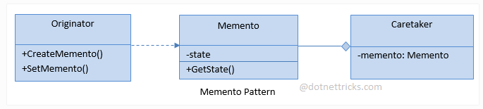

# MEMENTO
## Design Patterns 

**About this project (en-US 🇺🇸).**

## Why?

This project is part of my personal portfolio, so any feedback or suggestion that can contribute to my growth and improve my development skills will be most welcome.

# Project description:

Speaking a little about Design Patterns. The example project used here is about Memento.

Memento allows you to store the internal state of an object at a given time, so that it can be returned to this state, without this causing problems with encapsulation.

## Implementation:

**Complexity level:** HIGH LEVEL
**Popularity:** LOW

Some Upsides:

- Produce snapshots of object without violating its encapsulation.

--------------------------------------------------------------------------------------------------------------------------------------------------------------------------------
**Sobre o projeto (pt-BR 🇧🇷).**

## Descição do projeto:

Falando um pouco sobre Padrões de Projeto (Design Patterns), o exemplo praticado aqui é o Memento.

O Memento permite armazenar o estado interno de um objeto em um determinando momento, para que seja possível retorná-lo a este estado, sem que isso cause problemas com o encapsulamento.

## Implementação:

**Nível de complexidade:** ALTA COMPLEXIDADE
**Popularidade:** BAIXA

Algumas Vantagens:

- Pode produzir uma cópia instantânea do objeto sem violar seu encapsulamento.

