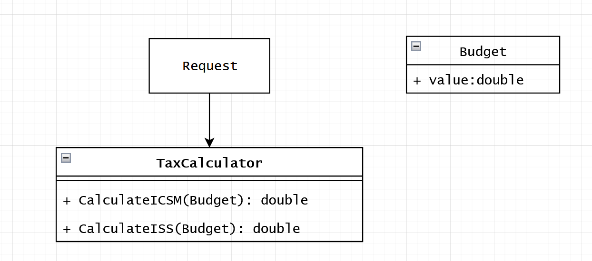
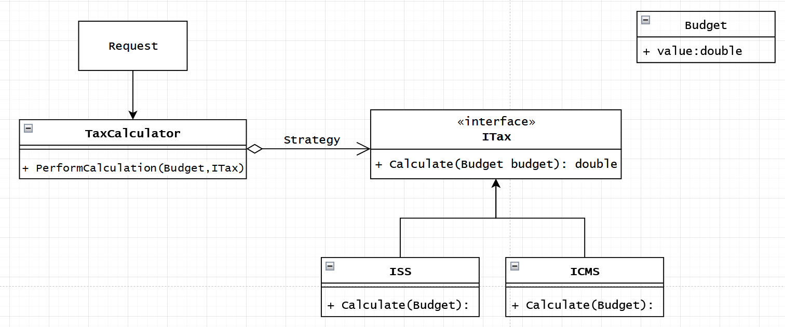
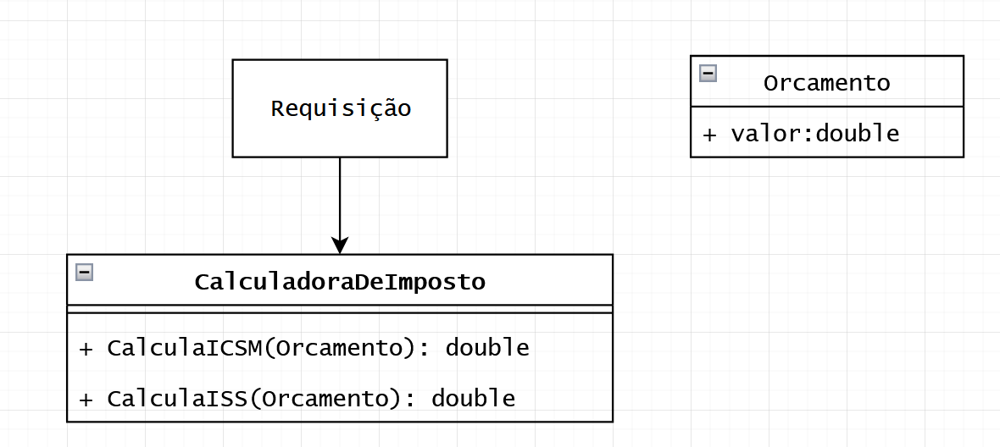
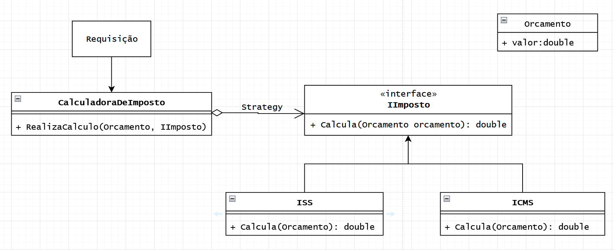

# STRATEGY
## Design Patterns 

**About this project (en-US 🇺🇸).**

## Why?

This project is part of my personal portfolio, so any feedback or suggestion that can contribute to my growth and improve my development skills will be most welcome.

# Project description:

Speaking a little about Design Patterns. The example project used here is about STRATEY.

Strategy is a design pattern that allows you to define new operations without changing the classes of the elements on which it operates, increasing cohesion, code maintainability and reducing coupling.

Below we have two representations in class diagrams of how to implement a functionality for tax calculation.

## Bad way

Some Downsides:
- High coupling
- Bad maintainability

## Good way:

Some Upsides:

- Low coupling
- Replace inheritance with composition.
- Applied the Open-closed Principle (SOLID)
- Dependency Inversion Principle

--------------------------------------------------------------------------------------------------------------------------------------------------------------------------------
**Sobre o projeto (pt-BR 🇧🇷).**

## Descição do projeto:

Falando um pouco sobre Padrões de Projeto (Design Patterns), o exemplo praticado aqui é o STRATEGY.

O Strategy é um padrão que permite definir novas operações sem alterar as classes dos elementos sobre os quais opera, aumentando a coesão, manutenibilidade do código e reduzindo o acoplamento.

Abaixo temos uma duas representações em diagramas de classes de como imlementar uma funcionalidade para cálculo de imposto.

## Solução menos adequada

Algumas Desvantagens:
- Alto acoplamento
- Manutenibilidade ruim

## Solução mais adequada:

Algumas Vantagens:

- Baixo acomplamento
- Substituir herança por composição.
- Aplicado o Princípio Aberto-Fechado (SOLID)
- Inversão de dependência
