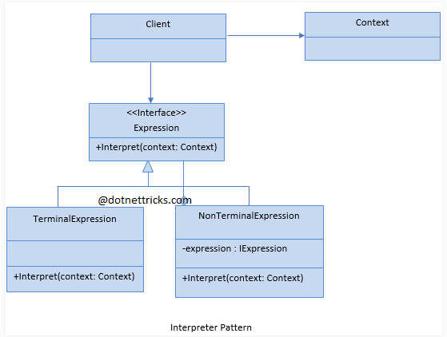
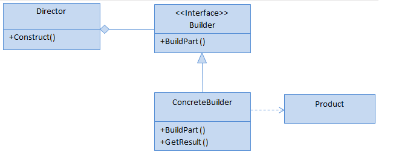

# INTERPRETER
## Design Patterns 

**About this project (en-US 🇺🇸).**

## Why?

This project is part of my personal portfolio, so any feedback or suggestion that can contribute to my growth and improve my development skills will be most welcome.

# Project description:

Speaking a little about Design Patterns. The example project used here is about Interpreter.

Interpreter seeks to solve modeling problems that deal with the behavior of classes.

## Implementation:

**Complexity level:** MID LEVEL

**Popularity:** MEDIUM

Some Upsides:

- Good for solving class hierarchy problems.

--------------------------------------------------------------------------------------------------------------------------------------------------------------------------------
**Sobre o projeto (pt-BR 🇧🇷).**

## Descição do projeto:

Falando um pouco sobre Padrões de Projeto (Design Patterns), o exemplo praticado aqui é o Interpreter.

O Interpreter permite produzir diferentes tipos e representações de um objeto usando o mesmo código de construção.

## Implementação:

**Nível de complexidade:** MÉDIA COMPLEXIDADE

**Popularidade:** MÉDIA

Algumas Vantagens:

- Bom para resolver problemas ligados a hierarquia de classes.

