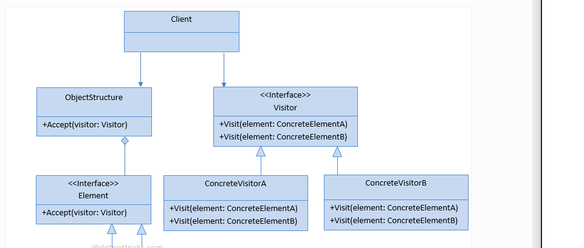

# VISITOR
## Design Patterns 

**About this project (en-US 🇺🇸).**

## Why?

This project is part of my personal portfolio, so any feedback or suggestion that can contribute to my growth and improve my development skills will be most welcome.

# Project description:

Speaking a little about Design Patterns. The example project used here is about Visitor.

Visitor allows you to create a new operation without changing the class of elements on which it operates.
## Implementation:

**Complexity level:** HIGH LEVEL

**Popularity:** LOW

Some Upsides:

- Applied the Single-responsibility Principle (SOLID).
- Applied the Open-closed Principle (SOLID).
- Useful when you want to traverse some complex structure of objects.

--------------------------------------------------------------------------------------------------------------------------------------------------------------------------------
**Sobre o projeto (pt-BR 🇧🇷).**

## Descição do projeto:

Falando um pouco sobre Padrões de Projeto (Design Patterns), o exemplo praticado aqui é o Visitor.

O Visitor permite que se crie uma nova operação sem que se mude a classe dos elementos sobre as quais ela opera.

## Implementação:

**Nível de complexidade:** ALTA COMPLEXIDADE

**Popularidade:** BAIXA

Algumas Vantagens:

- Aplicado o Princípio da responsabilidade única (SOLID).
- Aplicado o Princípio Aberto-Fechado (SOLID).
- Útil quando você deseja percorrer alguma estrutura complexa de objetos

