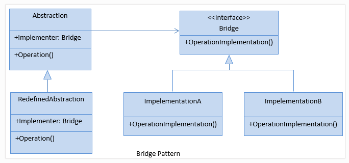

# BRIDGE
## Design Patterns 

**About this project (en-US 🇺🇸).**

## Why?

This project is part of my personal portfolio, so any feedback or suggestion that can contribute to my growth and improve my development skills will be most welcome.

# Project description:

Speaking a little about Design Patterns. The example project used here is about Bridge.

The Bridge pattern is used when it is necessary that an interface can vary independently of its implementations.

## Implementation:

**Complexity level:** HIGH LEVEL

**Popularity:** LOW

Some Upsides:

- Applied the Single-responsibility Principle (SOLID).
- Applied the Open-closed Principle (SOLID).
- You can create platform-independent classes and applications.
- Client code works with high-level abstractions

--------------------------------------------------------------------------------------------------------------------------------------------------------------------------------
**Sobre o projeto (pt-BR 🇧🇷).**

## Descição do projeto:

Falando um pouco sobre Padrões de Projeto (Design Patterns), o exemplo praticado aqui é o Bridge.

O padrão Bridge é utilizado quando é desejável que uma interface possa variar independentemente das suas implementações.

## Implementação:

**Nível de complexidade:** ALTA COMPLEXIDADE

**Popularidade:** BAIXA

Algumas Vantagens:

- Aplicado o Princípio da responsabilidade única (SOLID).
- Aplicado o Princípio Aberto-Fechado (SOLID).
- É possível criar classes e aplicativos independentes da plataforma.
- O código do cliente funciona com abstrações de alto nível.

