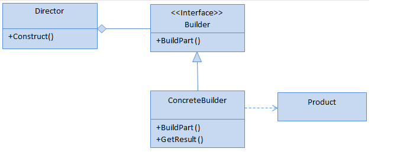
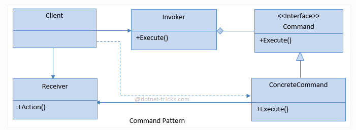

# COMMAND
## Design Patterns 

**About this project (en-US 🇺🇸).**

## Why?

This project is part of my personal portfolio, so any feedback or suggestion that can contribute to my growth and improve my development skills will be most welcome.

# Project description:

Speaking a little about Design Patterns. The example project used here is about Command.

Command is a pattern in which an object is used to encapsulate all the information needed to perform an action or trigger an event at a later time.

## Implementation:

**Complexity level:** LOW LEVEL

**Popularity:** HIGH

Some Upsides:

- Applied the Single-responsibility Principle (SOLID).
- Applied the Open-closed Principle (SOLID).
- Create events.

--------------------------------------------------------------------------------------------------------------------------------------------------------------------------------
**Sobre o projeto (pt-BR 🇧🇷).**

## Descição do projeto:

Falando um pouco sobre Padrões de Projeto (Design Patterns), o exemplo praticado aqui é o Command.

O Command é um padrão no qual um objeto é usado para encapsular toda informação necessária para executar uma ação ou acionar um evento em um momento posterior.

## Implementação:

**Nível de complexidade:** BAIXA COMPLEXIDADE

**Popularidade:** ALTA

Algumas Vantagens:

- Aplicado o Princípio da responsabilidade única (SOLID).
- plicado o Princípio Aberto-Fechado (SOLID).
- Criar eventos.

