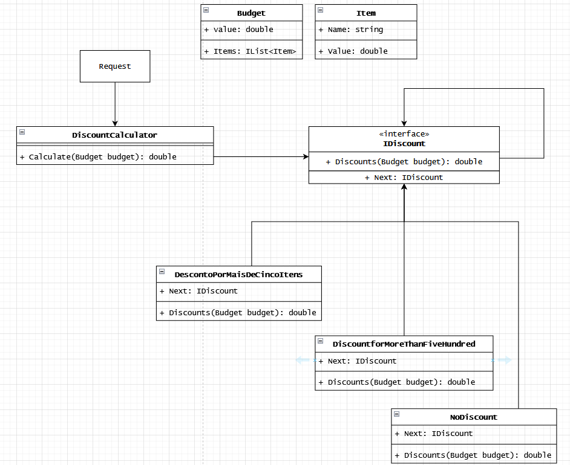
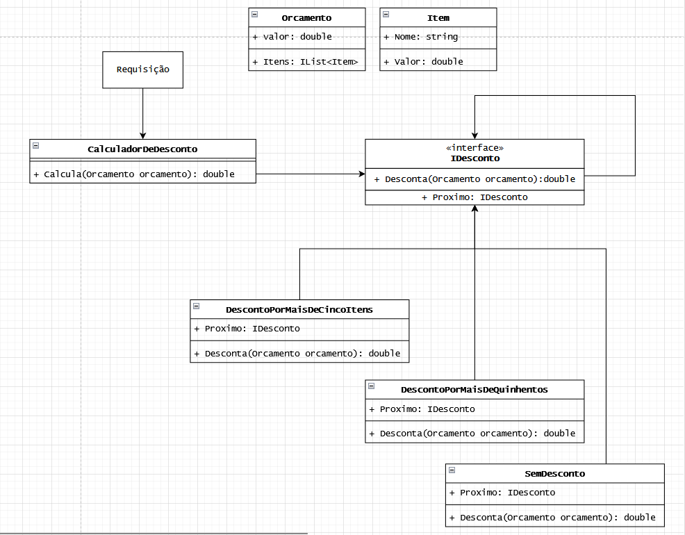

# CHAIN OF RESPONSIBILITY
## Design Patterns 

**About this project (en-US 🇺🇸).**

## Why?

This project is part of my personal portfolio, so any feedback or suggestion that can contribute to my growth and improve my development skills will be most welcome.

# Project description:

Speaking a little about Design Patterns. The example project used here is about CHAIN OF RESPONSIBILITY.

Chain of responsibility avoids the dependency between a receiving object and a requesting object, increasing cohesion, code maintainability and reducing coupling.

## Implementation:

Some Upsides:

- Low coupling
- Applied the Single-responsibility Principle (SOLID)
- Applied the Open-closed Principle (SOLID)

--------------------------------------------------------------------------------------------------------------------------------------------------------------------------------
**Sobre o projeto (pt-BR 🇧🇷).**

## Descição do projeto:

Falando um pouco sobre Padrões de Projeto (Design Patterns), o exemplo praticado aqui é o CHAIN OF RESPONSIBILITY.

O Chain of responsibility visa evitar a dependência entre um objeto receptor e um objeto solicitante, aumentando a coesão, manutenibilidade do código e reduzindo o acoplamento.

## Implementação:

Algumas Vantagens:

- Baixo acomplamento
- Aplicado o Princípio da responsabilidade única (SOLID)
- Aplicado o Princípio Aberto-Fechado (SOLID)
