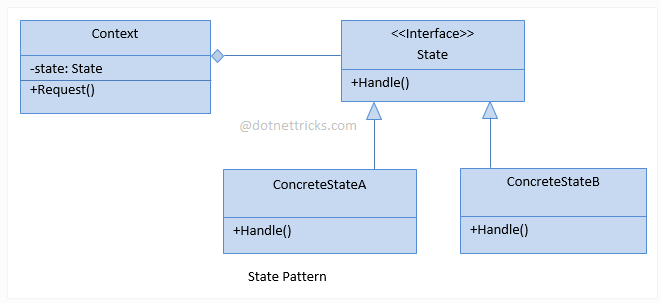

# STATE
## Design Patterns 

**About this project (en-US 🇺🇸).**

## Why?

This project is part of my personal portfolio, so any feedback or suggestion that can contribute to my growth and improve my development skills will be most welcome.

# Project description:

Speaking a little about Design Patterns. The example project used here is about State.
State is used when an object's behavior changes depending on its state.
## Implementation:

Some Upsides:

- Applied the Single-responsibility Principle (SOLID).
- Applied the Open-closed Principle (SOLID).

--------------------------------------------------------------------------------------------------------------------------------------------------------------------------------
**Sobre o projeto (pt-BR 🇧🇷).**

## Descição do projeto:

Falando um pouco sobre Padrões de Projeto (Design Patterns), o exemplo praticado aqui é o State.
O State é usado quando o comportamento de um objeto muda, dependendo do seu estado.

## Implementação:

Algumas Vantagens:

- Aplicado o Princípio da responsabilidade única (SOLID).
- Aplicado o Princípio Aberto-Fechado (SOLID).

