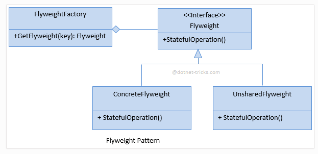

# FLYWEIGHT
## Design Patterns 

**About this project (en-US 🇺🇸).**

## Why?

This project is part of my personal portfolio, so any feedback or suggestion that can contribute to my growth and improve my development skills will be most welcome.

# Project description:

Speaking a little about Design Patterns. The example project used here is about Flyweight.

Flyweight is an appropriate software design pattern when multiple objects must be manipulated in memory, many of which have repeated information.

## Implementation:

**Complexity level:** HIGH LEVEL
**Popularity:** LOW

Some Upsides:

- You can save a lot of RAM, considering that the program has many repeated objects.

--------------------------------------------------------------------------------------------------------------------------------------------------------------------------------
**Sobre o projeto (pt-BR 🇧🇷).**

## Descição do projeto:

Falando um pouco sobre Padrões de Projeto (Design Patterns), o exemplo praticado aqui é o Flyweight.

Flyweight é um padrão de projeto de software apropriado quando vários objetos devem ser manipulados em memória sendo que muitos deles possuem informações repetidas.

## Implementação:

**Nível de complexidade:** ALTA COMPLEXIDADE
**Popularidade:** BAIXA

Algumas Vantagens:

- Você pode economizar muita memória RAM, considerando que o programa possui muitos objetos repetidos.

