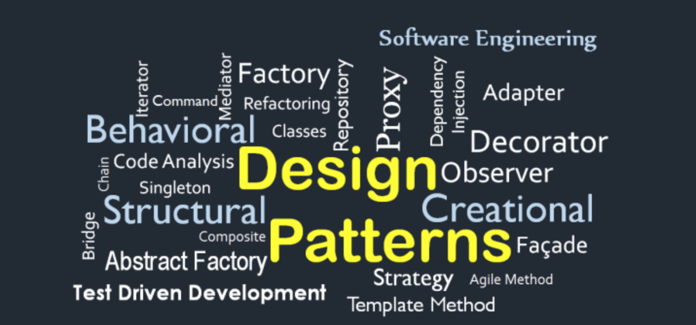

# DesignPatterns
## Examples of how to use a Design Pattern

**Budget system**

###### Info: 
Framework Version: DotNet 6 

###### NOTE: 
All examples represent a progression of a budget system using appropriate Design Patterns for each situation.

Each enumerated folder contains a Design Pattern type. Just choose one to get started! 
I hope I can help =)

###### Just in case: 
**This project is part of my personal portfolio, so any feedback or suggestion that can contribute to my growth and improve my development skills will be most welcome.**

